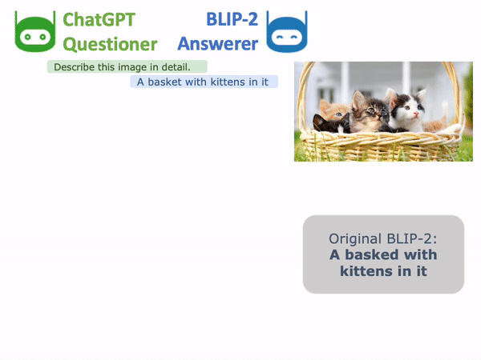
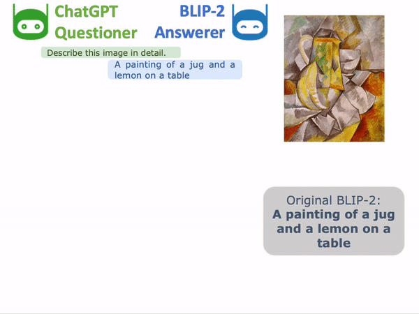
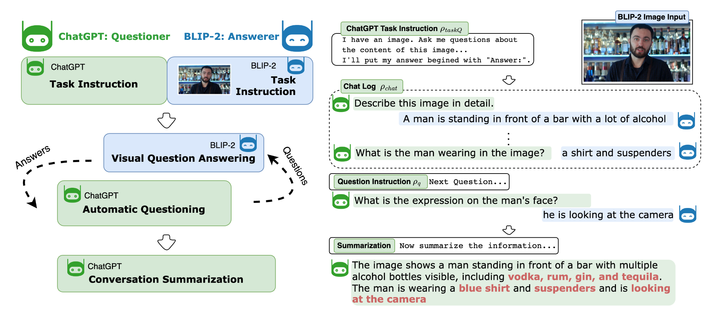

# ChatGPT Asks, BLIP-2 Answers: Automatic Questioning Towards Enriched Visual Descriptions

Official repository of **ChatCaptioner**.
ChatCaptioner enrichs the image caption of BLIP-2 by 
prompting ChatGPT to keep asking informative questions to BLIP-2 
and summarize the conversation at the end as the final caption.

## Demo




## System Architecture



## Installation

To start download our dataset samples from [here](https://drive.google.com/file/d/19yQP9lepLeS2_vSHnYPeOdfQz8OI1e6V/view?usp=share_link) and extract the zip file to the root folder.
After the extraction, the datafolder should look like this

```
.
├── chatcaptioner
├── datasets
│   ├── artemis
│   ├── coco_val
│   └── cc_val
│       ├── annotation.yaml
│       └── img
│           ├── annotation.yaml
│           ├── 85.jpg
│           ...
├── caption.ipynb
...   
```


To install and activate the environment, run the following command:

```
conda env create -f environment.yml
conda activate chatcap
```

Set the environment variable OPENAI_API_KEY to your OpenAI API Key. 

```
export OPENAI_API_KEY=Your_OpenAI_Key
```
You can add it to .bashrc so you don't need to set it manually everytime.


As many scripts here are in jupyter notebook, don't forget to add the environment to jupyter's kernel list. 
To do so, run

```
python -m ipykernel install --user --name=chatcap
```


## Usage
To play with ChatCaptioner with a given image, check the jupyter script 'caption_demo.ipynb'

To play with ChatCaptioner with a few dataset samples, check the jupyter script 'caption.ipynb'.


To caption all the images in the datasets, run 'main_caption.py'. 
Using --exp_tag to tag your runs and using --datasets to specify the datasets you want to caption. 

```
# caption all the sampled images in the datasets 'cc_val' and 'artemis' using GPU-0 and save results to experiments/test
python main_caption.py --exp_tag test --datasets cc_val artemis  --device_id 0
```

Datasets available are 'artemis', 'cc_val', 'coco_val', 'pascal'

+ [Artemis](https://www.artemisdataset.org/)
+ [MSCOCO](https://cocodataset.org/#home)
+ [Conceptual Captions](https://ai.google.com/research/ConceptualCaptions/)
+ [Pascal VOC](http://host.robots.ox.ac.uk/pascal/VOC/voc2010/)

## Visualization

To visualize the caption results, check the jupyter script 'visualization.ipynb'.


## Acknowledgement

+ [ChatGPT](https://openai.com/blog/chatgpt/)
+ [BLIP2](https://huggingface.co/docs/transformers/main/model_doc/blip-2)

